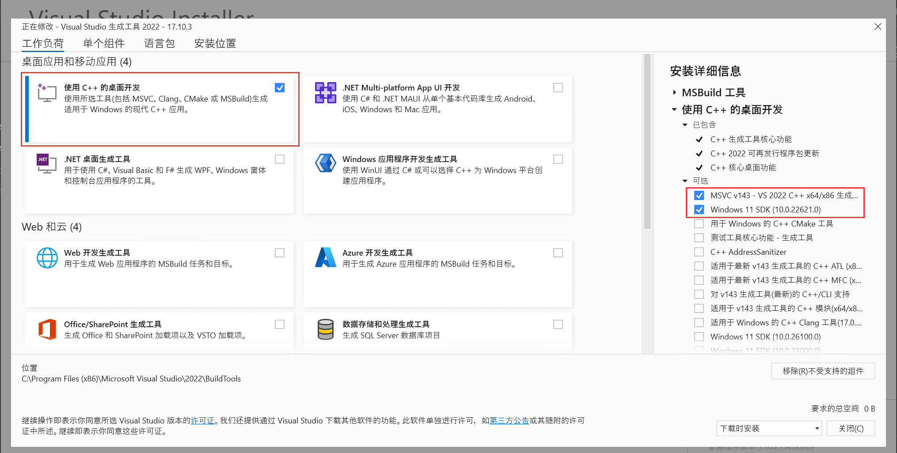

# Env Setup Guide for Windows

## 1. Install Scoop Package Manager

Run the following commands from a regular (non-admin) PowerShell terminal to install Scoop:

```powershell
Set-ExecutionPolicy -ExecutionPolicy RemoteSigned -Scope CurrentUser
Invoke-RestMethod -Uri https://get.scoop.sh -outfile 'install.ps1'
.\install.ps1 -ScoopDir 'C:\Scoop' -ScoopGlobalDir 'C:\ScoopApps' -NoProxy
# Ensure there is no space or Chinese character in ScoopGlobalDir
```

## 2. Install required packages using Scoop

```powershell
# Can be ignored if you already have git installed
scoop install main/git  
# Build essentials
scoop install main/llvm
scoop install main/mingw
scoop install main/cmake
```

## 3. Install Microsoft C++ Build Tools
Download and install Microsoft C++ Build Tools from the [official website](https://visualstudio.microsoft.com/visual-cpp-build-tools/).



Make sure to install the following components:

- Desktop development with C++
- Windows 11 SDK
- MSVC v143 - VS 2022 C++ x64/x86 build tools (v14.30)

If you missed any of the components, you can modify the installation by running the Visual Studio Installer.